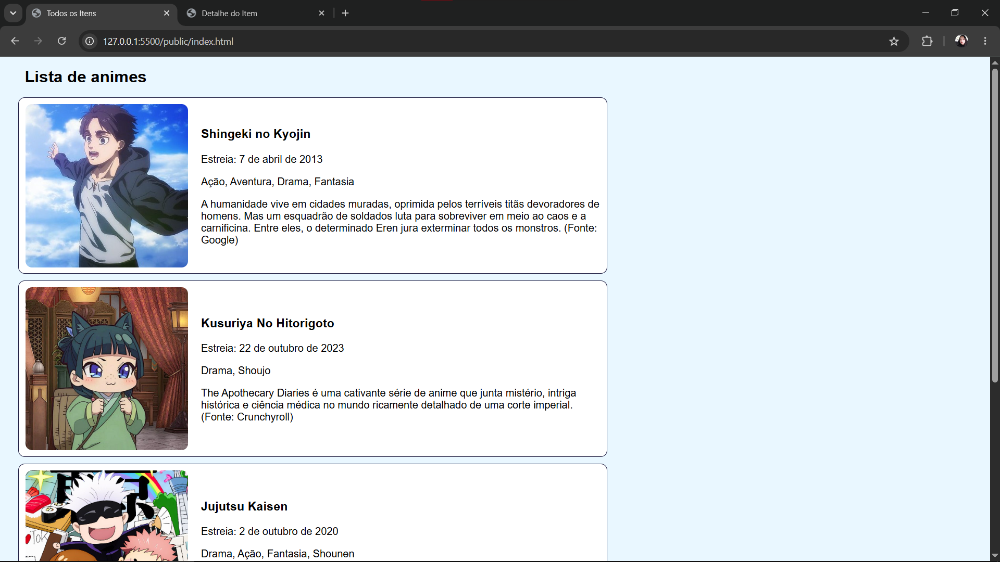
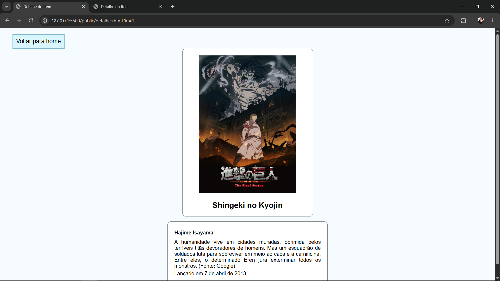

# Trabalho Prático - Semana 11

Nesta atividade, vamos dar continuidade ao projeto desenvolvido ao longo deste semestre, acrescentando a página de detalhes da aplicação.

Imagine que a página principal (home-page) mostre uma visão dos vários itens que existem no seu site. Ao clicar em um item, você é direcionado para a página de detalhes. A página de detalhes vai mostrar todas as informações sobre o item do seu projeto, seja esse item uma notícia, filme, receita, lugar turístico ou evento.

## Informações Gerais

- Nome: Nicole Vitória Santos
- Matrícula: 926915
- Descreva brevemente seu projeto: Esse projeto contém animes que já assisti e se tornaram alguns dos meus favoritos, e que eu indicaria para pessoas que desejam começar a assistir anime também.

## Prints do trabalho

<<  COLOQUE A IMAGEM - HOME-PAGE - AQUI >>

<<  COLOQUE A IMAGEM - TELA DE DETALHES - AQUI >>


## Dados em JSON
Inclua abaixo a estrutura de dados definida para o seu projeto, apresentando pelo menos dois exemplos de registros em formato JSON.

```json
 {
    "animes": [
      {
        "id": 1,
        "nome": "Shingeki no Kyojin",
        "estreia": "7 de abril de 2013",
        "categoria": ["Ação", "Aventura", "Drama", "Fantasia"],
        "imagem": "./img/attack-icon.jpg",
        "imagemDet": "./img/aot-det.jpg",
        "criador": "Hajime Isayama",
        "descricao": "A humanidade vive em cidades muradas, oprimida pelos terríveis titãs devoradores de homens. Mas um esquadrão de soldados luta para sobreviver em meio ao caos e a carnificina. Entre eles, o determinado Eren jura exterminar todos os monstros. (Fonte: Google)",
        "assistido": true
      },
      {
        "id": 2,
        "nome": "Kusuriya No Hitorigoto",
        "estreia": "22 de outubro de 2023",
        "categoria": ["Drama", "Shoujo"],
        "imagem": "./img/diarios-icon.jpg",
        "imagemDet": "./img/diaries-det.jpg",
        "criador": "Natsu Hyūga",
        "descricao": "The Apothecary Diaries é uma cativante série de anime que junta mistério, intriga histórica e ciência médica no mundo ricamente detalhado de uma corte imperial. (Fonte: Crunchyroll)",
        "assistido": true
      },
      {
        "id": 3,
        "nome": "Jujutsu Kaisen",
        "estreia": "2 de outubro de 2020",
        "categoria": ["Drama", "Ação", "Fantasia", "Shounen"],
        "imagem": "./img/jujutsu-icon.jpg",
        "imagemDet": "./img/jjk-det.jpg",
        "criador": "Gege Akutami",
        "descricao": "A história acompanha Yuji Itadori, um estudante que engole o dedo de Sukuna — o Rei das Maldições — e entra para o mundo dos feiticeiros jujutsu para combater espíritos malignos. (Fonte: Google)",
        "assistido": true
      },
      {
        "id": 4,
        "nome": "Dungeon Meshi",
        "estreia": "4 de janeiro de 2024",
        "categoria": ["Ficção científica", "Fantasia", "Shounen"],
        "imagem": "./img/dungeon-icon.jpg",
        "imagemDet": "./img/dungeon-det.jpg",
        "criador": "Ryoko Kui",
        "descricao": "A história segue o cavaleiro Laios e seu grupo, que decidem cozinhar e comer os monstros da masmorra para sobreviver e salvar sua irmã, devorada por um dragão. (Fonte: Google)",
        "assistido": true
      }
    ]
  }
```


